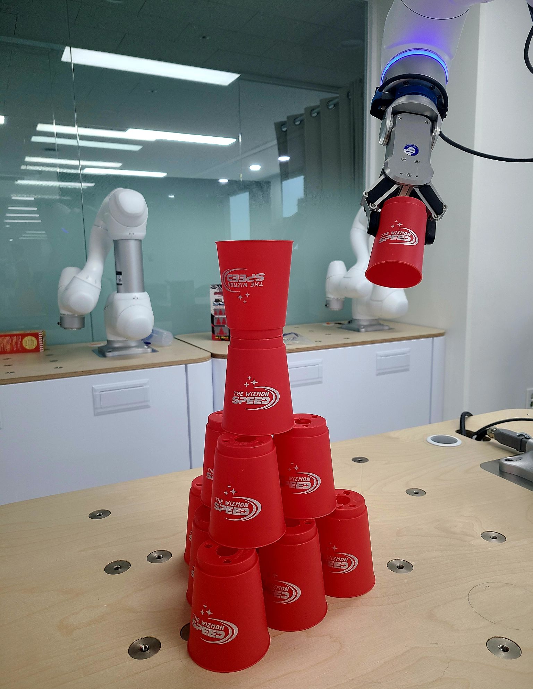
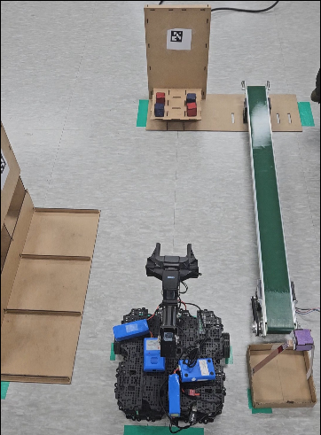
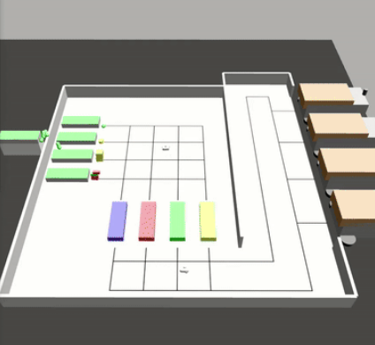

# Robot_Project - 두산로보틱스 프로젝트

실제 로봇 제어 및 자동화 공정 프로젝트 경험을 기반으로 구성한 포트폴리오입니다.
ROS2 기반 로봇 암 제어, AMR(자율주행로봇) 시스템 구축, 스마트 팩토리 시뮬레이션 모델링 등 실제 산업 환경에서의 문제 해결 경험을 담았습니다.

---

## 📌 Projects Overview

<table style="width:100%; table-layout:fixed;">
  <tr>
    <th style="width:33%; text-align:center;"> <a href="#pj1"><b>Project 1. 협동로봇 컵스태킹</b></a> </th>
    <th style="width:33%; text-align:center;"> <a href="#pj2"><b>Project 2. AMR 기반 자재 운반 자동화</b></a> </th>
    <th style="width:33%; text-align:center;"> <a href="#pj3"><b>Project 3. 가상 팩토리 환경 제작</b></a> </th>
  </tr>
  <tr>
    <td style="width:33%; text-align:center;"></td>
    <td style="width:33%; text-align:center;"></td>
    <td style="width:33%; text-align:center;"></td>
  </tr>
  <tr>
    <td style="width:33%; vertical-align:top;">ROS2 기반 로봇 암 + 그리퍼를 활용해 삼각뿔 컵 조형물을 자동으로 구축하는 프로젝트</td>
    <td style="width:33%; vertical-align:top;">Vision + ROS2 + PyQt 기반, 박스 픽업 및 컨베이어 이동을 자동화한 AMR 시스템 구축</td>
    <td style="width:33%; vertical-align:top;">Gazebo 시뮬레이션 환경 제작 및 다중 AMR 기반 팩토리 설계</td>
  </tr>
</table>
---

# 🦾 Project 1. 협동로봇(두산로봇) 컵스태킹<a id = "pj1"></a>

### 📎 기술 스택

* **환경**: Ubuntu 22.04 / ROS2 / Python
* **기술**: MoveIt, RVIZ2, Force Control, Bézier Curve Planning
* **역할 기여도**:

  * 패스트 스태킹 알고리즘 개발 **70%**
  * 싱글 스태킹 알고리즘 개발 **20%**
<br>

## 🎯 프로젝트 개요

* 입력된 **기준 좌표 + 층 수**만으로 반복 가능한 컵 조형물 구축
* 실 환경에서의 오차(중력/탄성/높이)를 고려한 정밀 제어
* 하드코딩 제거 → **알고리즘 기반 자동 배치**
<br>


## 🧠 핵심 알고리즘 (Fast vs Single Stacking)

<table width="100%">
  <tr>
    <th width="50%" align="center">Fast Stacking (속도 중심)</th>
    <th width="50%" align="center">Single Stacking (정확도 중심)</th>
  </tr>
  <tr>
    <td width="50%" align="center">
      
    </td>
    <td width="50%" align="center">
      
    </td>
  </tr>
  <tr>
    <td width="50%" valign="top">
      <ul>
        <li>여러 개의 컵을 동시에 잡기 위한 <strong>Wide-grip picking 로직</strong></li>
        <li>이동 중 컵을 지지하는 <strong>툴 각도 보정</strong></li>
        <li>삼각형 외심 좌표 기반 배치</li>
      </ul>
    </td>
    <td width="50%" valign="top">
      <ul>
        <li>Force control 기반, 실제 컵 <strong>position 추정</strong></li>
        <li>Bézier 곡선 기반 <strong>부드러운 경로 생성</strong></li>
        <li>가장 먼 컵부터 배치하여 충돌 경로 방지</li>
        <li>뒤집힌 컵을 올리기 위한 <strong>Flip motion</strong> 구현</li>
      </ul>
    </td>
  </tr>
</table>
<br>

## 🔧 문제점 및 개선점

### ❗ 문제점 (Fast Stacking)
- 초기 컵 위치 오차 → 성공률 **40%**
- Release 시 아래층 컵 밀림 → 구조적 불안정성

### ✅ 개선점 (Single Stacking)
- Force Control 도입 → **정확한 위치 보정**
- Bézier 경로 생성 → **부드럽고 안전한 이동**
- 가장 먼 컵부터 배치 → **경로 간섭 최소화**
- Flip motion 구현 → **조형물 꼭대기 컵 뒤집기 가능**
<br>

## 📦 Package Structure
```
My_package/
├── core/
│   ├── robot_controller.py      
│   ├── gripper_utils.py         
│   ├── force_control.py
│   ├── cup_stack_triangle.py
│   ├── behaviors/
│   │   └── throw_cup.py         
│   └── perception/
│       └── getting_position.py
├── tools/
│   └── jog_gui.py  
└─ test/
   └─ fast_stacking.py
```
### `robot_controller.py`
ROS2 Node 기반의 **메인 로봇 컨트롤 클래스**
- Robot ID/Model/TCP 설정
- MoveJ / MoveL / MoveSX 명령 실행 담당
- Force/Gripper/Stack Behavior 모듈을 import해서 구동


### `gripper_utils.py`
**디지털 IO 신호 기반 그리퍼 동작 유틸**
- `grip()` / `release()` 동작 통합
- Digital output ON/OFF 및 입력 신호 대기(optional) 포함


### `force_utils.py`
**Force-based Z 탐색 및 컴플라이언스 제어 함수**
- `task_compliance_ctrl()` 시작/해제 래퍼 제공
- `check_force_condition()` 루프 헬퍼 통합
- Z축 기반 picking/align 로직에 사용


### `cup_stack_triangle.py`
**컵 스택 포지션 리스트 생성(삼각 외심 기반 stacking)**
- 컵 반지름/층 수 기반 pose 생성
- Y축 정렬 기준으로 sorting 후 반환
- 실제 stacking motion에서 바로 사용


### `behaviors/throw_cup.py`
**특수 행동 모듈**
- 컵을 잡고 joint motion으로 흔들어 던지는 시나리오 담당
- Pick & throw 동작 시퀀스를 하나의 behavior로 캡슐화
<br>

## 💡 담당 업무 정리

* 패스트 스태킹과 싱글 스태킹 동시 사용하는 Force Control 적용, 실제 컵 위치 pose 읽어오는 로직 구현
* Bézier 기반 이동 경로 생성 및 MoveIt 동작 개선
* 기준 좌표–층수 기반 자동 배치 수학적 로직 구현
* Flip 동작(컵을 눕혀 뒤집는 동작) 알고리즘 설계 및 안전범위 튜닝
<br>

---
---
<br>

# 🚚 Project 2. AMR 기반 자재 운반 자동화<a id = "pj2"></a>

### 📎 기술 스택

* **환경**: Ubuntu 22.04 / Python
* **기술**: ROS2, OpenCV(aruco), YOLOv8, PyQt, Conveyor Motor Control
* **역할 기여도**:

  * YOLO 학습 **30%**
  * Camera Calibration **50%**
  * 컨베이어 벨트 제어 **100%**
<br>

## 🎯 프로젝트 개요

<table style="width:100%; border:0; border-spacing:0; border-collapse:collapse;">
  <tr>
    <td style="width:20%; border:0;"></td>
    <td style="width:20%; border:0;"></td>
    <td style="width:20%; border:0;"></td>
    <td style="width:20%; border:0;"></td>
    <td style="width:20%; border:0;"></td>
  </tr>
</table>

<table style="width:100%; border:0; border-spacing:0; border:0; border-collapse:collapse; box-shadow:none;">
  <tr>
    <td style="width:60%; border:0; vertical-align:top; text-align:center;">
      
    </td>
    <td style="width:40%; border:0; vertical-align:top; text-align:left;">
      <ul style="margin:0; padding-left:13px; list-style-type:disc;">
        <li>GUI에서 특정 박스 운반 명령 전송</li><br>
        <li>AMR이 아루코 마커 기반 위치 인식</li><br>
        <li>박스 픽업 → 필요 수량만큼 컨베이어로 이동</li><br>
        <li>바구니로 이동 후 하역</li><br>
        <li>지정 위치까지 최종 운반</li>
      </ul>
    </td>
  </tr>
</table>
<br>


## 🔍 주요 기능


### ✔ Vision (YOLOv8 + ArUco)

- `"red"`, `"blue"`, `"mark"`, `"aruco"` **총 4종 객체 감지**

- **비전 및 위치 제어**를 위한 내부 파라미터 분석
    - 초점거리 : **21.0cm**
    - Pixel Distance : **1122px**
    - Meters per px : **0.000153 m/pixel**


### ✔ Conveyor Belt Control

* Arduino + Step Motor 기반
* 상태 표시

  `[DISCONNECT]` → `[INIT]` → `[READY]` → `[RUN]`

* 벨트 동작 및 물류 이동 동기화 담당

### ✔ AMR Control

* MoveIt + ROS2 기반 박스 잡기 pose 이동
* PyQt GUI로 AMR 상태 및 카메라 화면 실시간 표시
<br>

## 📦 Package Structure
```
your_package/
└─ core/
   ├─ C2_conveyor_final.py
   ├─ C2_manager.py
   ├─ C2_yolo_detect.py
   └─ vision/
      └─ C2_yolo_detect.py
└─ gui/
   └─ GUI.py
```


## Modules & Responsibility

### `core/conveyor.py`
- 컨베이어 **Serial(/dev/arduino, 115200 baud)** 통신 노드
- 컨베이어 상태 ENUM 관리:  
  `INIT`, `READY`, `RUN`, `DISCONNECT`
- `conveyor/control` 토픽(JSON) 수신 → Serial 명령 전송
  - `{"control": "go", "distance.mm": X}` → mm를 steps로 변환 후 전송
  - `{"control": "stop"}` → 정지 명령 전송
- `conveyor/status` 토픽으로 상태 발행


### `core/manager.py`
- 전체 **작업 흐름(State transition)** 오케스트레이션
- GUI job command 파싱 및 실행 순서 조율
- Vision(YOLO) / ArUco marker flags 기반 동작 단계 실행
- 로봇 모션 요청, 컨베이어 제어, 비전 감지 결과를 종합 판단


### `core/yolo_detect.py`
- 카메라 캘리브레이션(`mtx`, `dist`) 적용 후 **이미지 Undistort**
- YOLO inference 수행 + crosshair overlay(디버깅용)
- 감지 객체 box center 좌표를 **mm(m단위)*1000** 으로 변환
  - pixel→meter 계수: `0.000153`
- Publish outputs:
  - `yolo_image/compressed` → 결과 이미지
  - `yolo_image/detected_info` → 감지 객체 정보(JSON string)


### `tools/jog_gui.py`
- **Tkinter 기반 로봇 조그/티칭 GUI**
- 버튼 제공:
  - `movej`, `movel`, `movesx([...])`, `grip`, `release`
- 현재 joint/pose를 실시간으로 확인 및 증분 이동

### `GUI.py`
- ROS2와 연동된 PyQt5 기반의 컨베이어 제어 + 비전 결과 표시 GUI 애플리케이션


## Topic & Service Mapping

| Component | Subscribe Topic | Publish Topic |
|---|---|---|
| Conveyor | `conveyor/control` | `conveyor/status` |
| Vision | `image_raw/compressed` | `yolo_image/compressed`, `yolo_image/detected_info` |
| Manager | `gui/command` | `/conveyor/control` (`distance.mm` 전달) 및 Robot 요청 조율 |


<br>

## 💡 담당 업무 정리

* 아루코 마커 & YOLOv8 학습을 통한 위치 인식 개선
* 카메라 Calibration 직접 진행해 오차 보정
* 컨베이어 벨트 전체 제어 로직 설계
  (모터 드라이버, 아두이노 신호, 속도/방향 제어 등)
* GUI 내 AMR 상태 및 Vision 피드 통합 구성

<br>

---
---
<br>

# 🏭 Project 3. 가상 팩토리 환경 제작<a id = "pj3"></a>

### 📎 기술 스택

* **환경**: Ubuntu 22.04
* **기술**: ROS2, Gazebo, RVIZ2, PyQt 개발
* **역할 기여도**:

  * Gazebo 모델 제작 및 물리 엔진 구성 : **90%**
  * 관제 프론트 제작 : **90%**

<br>

## 🎯 프로젝트 개요

* 다중 AMR 기반 스마트 팩토리 시나리오 구축
* 실시간 모니터링 & 중앙 관제 시스템 개발
* URDF/SDF 기반 로봇 및 공장 전공정 모델링
<br>

## 🧱 Gazebo 모델링 구성

* **컨베이어 벨트(C++ 플러그인)**

  * 벨트 표면, 길이 읽어오기
  * 물리 엔진 StepSize 기반, x축 이동 속도 적용
* **World 파일 구성**

  * ground plane
  * 고정 카메라 3대
  * 컨베이어 벨트 5대
  * dump truck 4대
  * 조형물, 벽 등 장애물 모델링
<br>

## 🤖 AMR 다중 협업 시나리오

* 각 부품마다 8개 공정을 순환
* A* 기반 경로 계획
* Object–컨베이어 흐름 분리
* AMR들의 적재/조달/출하 자동화
<br>

## 📦 제작 파일 정보

### `conveyor.cpp`
- Gazebo 가상 환경 내부에서 컨베이어(모터) 동작을 구현한 플러그인 코드
- ROS 노드가 아니라 Gazebo 시뮬레이터에 로드되어 동작하는 하드웨어 모션 모듈
- 물체 이동/production line의 기반 motion 제공

### `multi_robot_world.world`
- 가상 팩토리의 전체 물리 월드 정의 파일
- 공장 레이아웃, 로봇 spawn 위치, 컨베이어 모델, 카메라 센서, 조명, 벽/바닥 등 환경 구성 포함
- 모든 SDF 모델을 참조하여 시뮬레이션 컨텍스트 제공하는 root world

### `model.sdf / model.config`
- Gazebo에서 스폰될 팩토리 오브젝트 모델 정의
- SDF 링크/충돌/시각 요소/스케일/정적 여부 지정
- .config에 모델 이름/메시 참조/메타정보 저장(launch/spawn에서 참조됨)

### `spawn_2.py`
- Arduino가 아닌 **Gazebo SpawnEntity 서비스(/spawn_entity)**를 호출하여 오브젝트 소환
- 랜덤 색상/랜덤 shape/capsule/box/rectangle 등을 특정 pose로 계속 스폰
- object1 -> object2 -> object3 ... 순차 이름 증가
- initial_pose.position(x,y,z) 랜덤 할당
- XML SDF 생성 후 Request 보냄
- 과거 detection 결과에 따라 삭제/리스폰 포함 X → 완전 랜덤 소환 전용

### `spawn_3.py`
- spawn_2.py의 확장 버전으로, 마지막 스폰된 객체 info(color,shape)를 기억
- YOLO 탐지 토픽(/yolo_result/object) 수신 시 특정 문자열 포함되면:
- last_object delete -> same color/shape로 target pose(-2.5,3.0,0.3)에 respawn
- 조건기반 감지 후 재생성(re-spawn) 담당
- picking/stacking 안하고 팩토리 object 위치 초기화/업데이트 테스트용

### `venv_yolo.py`
- Gazebo 카메라 토픽을 구독하여 YOLOv8 inference 실행하는 비전 감지 Node
- 이미지 왜곡 보정(calibration/aruco 없이 순 raw 추론만)
- 객체 감지 결과를 JSON 문자열로 String 토픽 발행

<br>


## 💡 담당 업무 정리

* 스마트 팩토리 전체 구조 모델링
* Vision 인식 물체 판별
* 시뮬레이션–관제–센서 데이터를 하나의 시스템으로 설계

