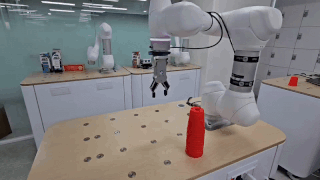
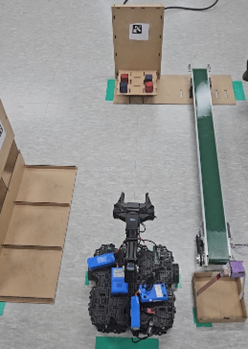
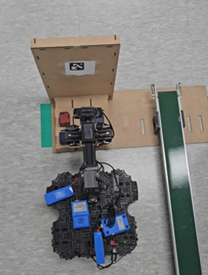
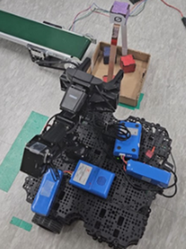
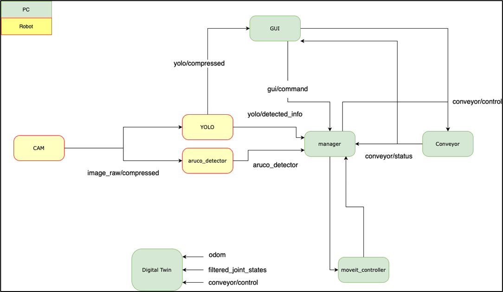
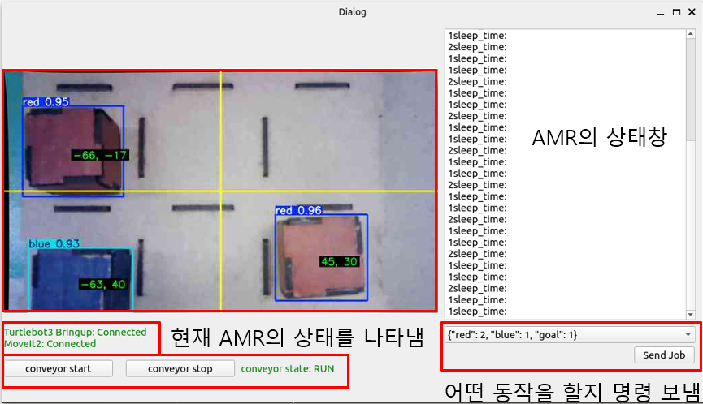
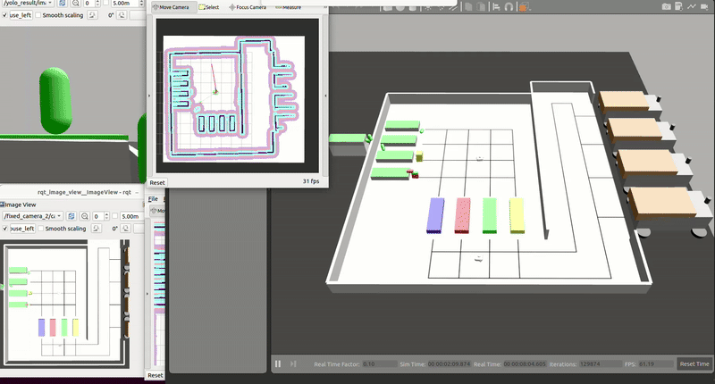

# Robot_Project - 두산로보틱스 프로젝트

실제 로봇 제어 및 자동화 공정 프로젝트 경험을 기반으로 구성한 포트폴리오입니다.
ROS2 기반 로봇 암 제어, AMR(자율주행로봇) 시스템 구축, 스마트 팩토리 시뮬레이션 모델링 등 실제 산업 환경에서의 문제 해결 경험을 담았습니다.

---

## 📌 Projects Overview

| [**Project 1. 협동로봇 컵스태킹**](#pj1) | [**Project 2. AMR 기반 자재 운반 자동화 공장**](#pj2) | [**Project 3. 스마트 팩토리 자동화 가상 구현**](#pj3) |
|:--------------------------------------------:|:---------------------------------------------:|:------------------------------------------------:|
|  |  |  |
| ROS2 기반 로봇 암 + 그리퍼를 활용해 삼각뿔 컵 조형물을 자동으로 구축하는 프로젝트 | Vision + ROS2 + PyQt 기반, 박스 픽업 및 컨베이어 이동을 자동화한 AMR 시스템 구축 | Gazebo 시뮬레이션 환경 제작 및 다중 AMR 경로 최적화 기반 스마트 팩토리 설계 |


---

# 🦾 Project 1. 협동로봇(두산로봇) 컵스태킹<a id = "pj1"></a>

### 📎 기술 스택

* **환경**: Ubuntu 22.04 / ROS2 / Python
* **기술**: MoveIt, RVIZ2, Force Control, Bézier Curve Planning
* **역할 기여도**:

  * 패스트 스태킹 알고리즘 개발 **70%**
  * 싱글 스태킹 알고리즘 개발 **20%**
<br>

## 🎯 프로젝트 개요

* 입력된 **기준 좌표 + 층 수**만으로 반복 가능한 컵 조형물 구축
* 실 환경에서의 오차(중력/탄성/높이)를 고려한 정밀 제어
* 하드코딩 제거 → **알고리즘 기반 자동 배치**
<br>

## 🧠 핵심 알고리즘 (Fast vs Single Stacking)

<table width="100%">
  <tr>
    <th width="50%" align="center">Fast Stacking (속도 중심)</th>
    <th width="50%" align="center">Single Stacking (정확도 중심)</th>
  </tr>
  <tr>
    <td width="50%" align="center">
      
    </td>
    <td width="50%" align="center">
      
    </td>
  </tr>
  <tr>
    <td width="50%" valign="top">
      <ul>
        <li>여러 개의 컵을 동시에 잡기 위한 <strong>Wide-grip picking 로직</strong></li>
        <li>이동 중 컵을 지지하는 <strong>툴 각도 보정</strong></li>
        <li>삼각형 외심 좌표 기반 배치</li>
      </ul>
    </td>
    <td width="50%" valign="top">
      <ul>
        <li>Force control 기반, 실제 컵 <strong>position 추정</strong></li>
        <li>Bézier 곡선 기반 <strong>부드러운 경로 생성</strong></li>
        <li>가장 먼 컵부터 배치하여 충돌 경로 방지</li>
        <li>뒤집힌 컵을 올리기 위한 <strong>Flip motion</strong> 구현</li>
      </ul>
    </td>
  </tr>
</table>
<br>

## 🔧 문제점 및 개선점

### ❗ 문제점 (Fast Stacking)
- 초기 컵 위치 오차 → 성공률 **40%**
- Release 시 아래층 컵 밀림 → 구조적 불안정성

### ✅ 개선점 (Single Stacking)
- Force Control 도입 → **정확한 위치 보정**
- Bézier 경로 생성 → **부드럽고 안전한 이동**
- 가장 먼 컵부터 배치 → **경로 간섭 최소화**
- Flip motion 구현 → **조형물 꼭대기 컵 뒤집기 가능**
<br>

## 💡 담당 업무 정리

* 패스트 스태킹과 싱글 스태킹 동시 사용하는 Force Control 적용, 실제 컵 위치 pose 읽어오는 로직 구현
* Bézier 기반 이동 경로 생성 및 MoveIt 동작 개선
* 기준 좌표–층수 기반 자동 배치 수학적 로직 구현
* Flip 동작(컵을 눕혀 뒤집는 동작) 알고리즘 설계 및 안전범위 튜닝
<br>

---
---
<br>

# 🚚 Project 2. AMR 기반 자재 운반 자동화 공장<a id = "pj2"></a>

### 📎 기술 스택

* **환경**: Ubuntu 22.04 / Python
* **기술**: ROS2, OpenCV(aruco), YOLOv8, PyQt, Conveyor Motor Control
* **역할 기여도**:

  * YOLO 학습 **30%**
  * Camera Calibration **50%**
  * 컨베이어 벨트 제어 **100%**
<br>

## 🎯 프로젝트 개요

<table width="100%" border="0" cellspacing="0" cellpadding="0">
  <tr>
    <td width="20%"></td>
    <td width="20%"></td>
    <td width="20%"></td>
    <td width="20%"></td>
    <td width="20%"></td>
  </tr>
</table>

<table width="100%" border="0" cellspacing="0" cellpadding="0">
  <tr>
    <td width="60%" valign="top" align="center">
      
    </td>
    <td width="40%" valign="top" align="left">
      <ul style="margin:0; padding-left:13px;">
        <li>GUI에서 특정 박스 운반 명령 전송</li>
        <li>AMR이 아루코 마커 기반 위치 인식</li>
        <li>박스 픽업 → 필요 수량만큼 컨베이어로 이동</li>
        <li>바구니로 이동 후 하역</li>
        <li>지정 위치까지 최종 운반</li>
      </ul>
    </td>
  </tr>
</table>
<br>


## 🔍 주요 기능



### ✔ Vision (YOLOv8 + ArUco)

- `"red"`, `"blue"`, `"mark"`, `"aruco"` **총 4종 객체 감지**

- **비전 및 위치 제어**를 위한 내부 파라미터 분석
    - 초점거리 : **21.0cm**
    - Pixel Distance : **1122px**
    - Meters per px : **0.000153 m/pixel**


### ✔ Conveyor Belt Control

* Arduino + Step Motor 기반
* 상태 표시

  ```
  [DISCONNECT] → [INIT] → [READY] → [RUN]
  ```
* 벨트 동작 및 물류 이동 동기화 담당

### ✔ AMR Control

* MoveIt + ROS2 기반 박스 잡기 pose 이동
* PyQt GUI로 AMR 상태 및 카메라 화면 실시간 표시
<br>

## 💡 담당 업무 정리

* 아루코 마커 & YOLOv8 학습을 통한 위치 인식 개선
* 카메라 Calibration 직접 진행해 오차 보정
* 컨베이어 벨트 전체 제어 로직 설계
  (모터 드라이버, 아두이노 신호, 속도/방향 제어 등)
* GUI 내 AMR 상태 및 Vision 피드 통합 구성

---
---
<br>

# 🏭 Project 3. 스마트 팩토리 자동화 가상 구현<a id = "pj3"></a>

### 📎 기술 스택

* **환경**: Ubuntu 22.04
* **기술**: ROS2, Gazebo, RVIZ2, PyQt 개발
* **역할 기여도**:

  * Gazebo 모델 제작 및 물리 엔진 구성 : **90%**
  * 관제 프론트 제작 : **90%**

<br>

## 🎯 프로젝트 개요

* 다중 AMR 기반 스마트 팩토리 시나리오 구축
* 실시간 모니터링 & 중앙 관제 시스템 개발
* URDF/SDF 기반 로봇 및 공장 전공정 모델링
<br>

## 🧱 Gazebo 모델링 구성

* **컨베이어 벨트(직접 C++ 플러그인 제작)**

  * 벨트 표면, 길이 읽어오기
  * 물리 엔진 StepSize 기반, x축 이동 속도 적용
* **World 파일 구성**

  * ground plane
  * 고정 카메라 3대
  * 컨베이어 벨트 5대
  * dump truck 4대
  * 조형물, 벽 등 장애물 모델링
<br>

## 🤖 AMR 다중 협업 시나리오

* 각 부품마다 8개 공정을 순환
* A* 기반 경로 계획
* Object–컨베이어 흐름 분리
* AMR들의 적재/조달/출하 자동화
<br>

## 💡 담당 업무 정리

* 스마트 팩토리 전체 구조 모델링
* Vision 인식 물체 판별
* 시뮬레이션–관제–센서 데이터를 하나의 시스템으로 설계


---